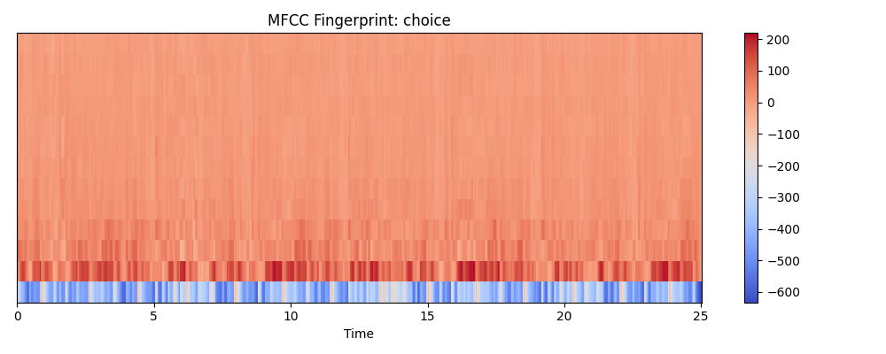

# 🎵 VibeMap: Unsupervised Audio Signal Processing (DSP)

**VibeMap** is a "Level 2" audio analysis engine that ignores metadata and looks directly at the raw waveform DNA. Instead of trusting Spotify's pre-made labels, it uses **Librosa** to perform feature extraction and **Scikit-Learn** to cluster music by its actual sonic "Vibe."

## 🚀 The Technical "Deep Dive"
- **Audio Decomposition:** Utilizes Short-Time Fourier Transforms (STFT) to extract 13 **MFCCs** (Mel-Frequency Cepstral Coefficients), capturing the timbre and texture of the audio.
- **Spectral Mapping:** Analyzes **Spectral Centroid** (brightness) and **Zero-Crossing Rate** (percussiveness) to quantify energy levels.
- **Unsupervised Learning:** Employs **StandardScaler** and **Euclidean Distance Matrices** to find the mathematical "closeness" between tracks.
- **Generative Reporting:** Integrated with an LLM to provide a "Critic's Review" of the user's sonic taste based on the extracted feature vectors.

## 📊 Sample Fingerprint (MFCC)

*This heatmap shows the 'Sonic DNA' of a Drum & Bass track compared to Classical.*

## 🛠️ Tech Stack
- **Languages:** Python
- **Libraries:** Librosa, NumPy, Pandas, Scikit-Learn, Matplotlib, Seaborn
- **AI/ML:** LlamaIndex / Ollama for the Generative Critic